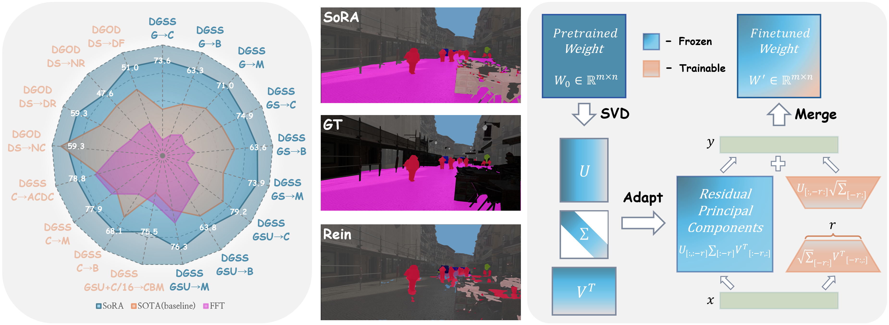

# SoRA: Singular Value Decomposed Low-Rank Adaptation for Domain Generalizable Representation Learning
Seokju Yun, Seunghye Chae, Dongheon Lee, Youngmin Ro

### [Project Page](https://ysj9909.github.io/SoRA.github.io/) | [arXiv](https://arxiv.org/abs/2412.04077)

  

  Abstract
  

Domain generalization (DG) aims to adapt a model using one or multiple source domains to ensure robust performance in unseen target domains. Recently, Parameter-Efficient Fine-Tuning (PEFT) of foundation models has shown promising results in the context of DG problem.
Nevertheless, existing PEFT methods still struggle to strike a balance between preserving generalizable components of the pre-trained model and learning task-specific features. To gain insights into the distribution of generalizable components, we begin by analyzing the pre-trained weights  through the lens of singular value decomposition. Building on these insights, we introduce Singular Value Decomposed Low-Rank Adaptation (SoRA), an approach that selectively tunes minor singular components while keeping the residual parts frozen. SoRA effectively retains the generalization ability of the pre-trained model while efficiently acquiring task-specific skills. Furthermore, we freeze domain-generalizable blocks and employ an annealing weight decay strategy, thereby achieving an optimal balance in the delicate trade-off between generalizability and discriminability. SoRA attains state-of-the-art results on multiple benchmarks that span both domain generalized semantic segmentation to domain generalized object detection. In addition, our methods introduce no additional inference overhead or regularization loss, maintain compatibility with any backbone or head, and are designed to be versatile, allowing easy integration into a wide range of tasks.

